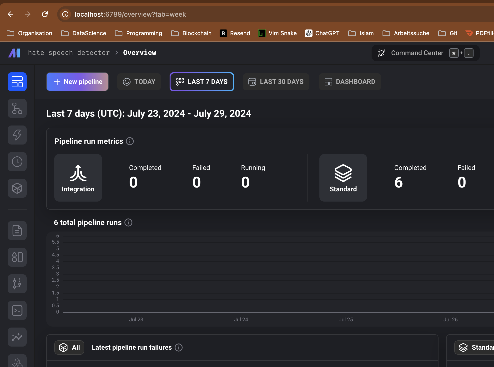
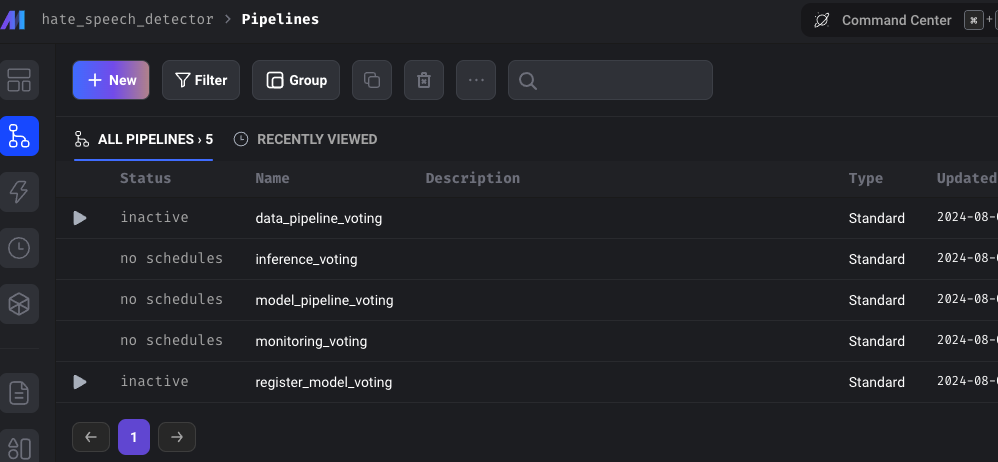
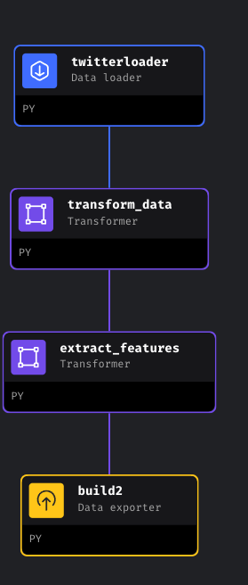
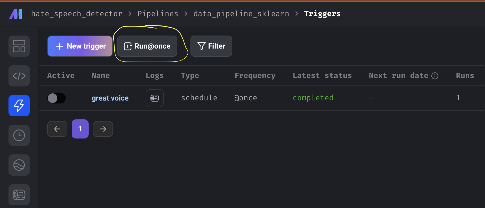
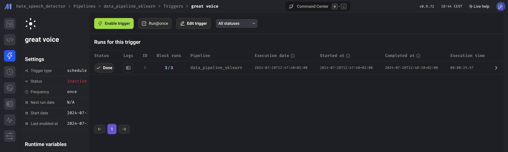

# HATE_SPEECH_DETECTOR

## Overview

The Hate Speech Detector is designed to identify and classify hate speech across social media and other digital platforms. Utilizing cutting-edge machine learning techniques, this tool aims to moderate content and foster a healthier online environment.

## Problem Statement

The rise of digital platforms has led to an increase in hate speech, negatively impacting individuals and communities by promoting violence and discrimination. The Hate Speech Detector seeks to accurately identify such content, enabling actions for its removal or marking, thus promoting inclusive and respectful online communication.

## Technology Stack

- **MLflow**: Manages experiments, model versioning, and deployment, streamlining the process of optimizing machine learning models.
- **Gradio**: Provides an easy-to-use library for creating web apps for machine learning models, allowing users to interact with the Hate Speech Detector in real-time.
- **FastApi**: Serves as the backend, using this micro web framework for Python to integrate with other components and provide a RESTful API.
- **Mage**: Orchestrates workflows, automating the machine learning lifecycle from data preparation to training and deployment, facilitating team collaboration and development process efficiency.

## Architecture

The Hate Speech Detector's architecture is modular, ensuring flexibility and scalability. Key components include the data processing module, machine learning model, web interface, and monitoring system, interconnected through FastApi and Mage for a seamless workflow from data input to output.

## Use Cases

- Moderating content on social media platforms
- Monitoring comments on news websites and blogs
- Assisting organizations in adhering to online communication policies

## Cloud Infrastructure

### Terraform

### Prerequisites

Before you begin, ensure you have the following:

- An Azure account
- Terraform installed on your local machine
- Azure CLI installed and authenticated

### Directory Structure

Ensure your project directory has the following structure:

```
/terraform
│
├── step1
│   └── step1.tf
    └── step1_1_create_push_image2registry.sh
│
├── step2
│   └── step2_1_tf_import_resources.sh
|   └── step2.tf
└──
```

[Step-by-step deployment guide](documentation/Terraform.md)

## Experiment Tracking and Registry with MLflow

This guide provides instructions for setting up experiment tracking and model registry using MLflow. It includes the containerization of the MLflow tracking server, parameter tuning with Optuna, logging parameters and artifacts, registering the best model, and downloading the best model artifact to Azure Blob Storage.

### Prerequisites

Before you begin, ensure you have the following:

- Docker installed on your local machine
- Azure Blob Storage account and container
- Python environment with necessary dependencies installed (e.g., MLflow, Optuna, Azure SDK)

### Directory Structure

Here you find the relevant files for the tracking and registry:

```
/hate_speech_detector
│
├── Dockerfile.mlflow
├── docker-compose.yml
├── hate_speech_detector
│   │
│   ├── data_exporters
│   │   └── download_artifact.py
│   │
│   ├── data_loaders
│   │    └── register_best_model.py
│   └── transformers
│   │    └── hyperparameter_optuna
│   │         └── sklearn.py
│   ├── utils
│   │    ├── logging.py
│   │     └── models
│   │         └── sklearn.py
│   │
```

[Detail description of the Tracking and Registry with MLflow](documentation/MLflow.md)

## Workflow orchestration and Monitoring with Mage

### Starting the MAGE Orchestration Server

This guide provides the steps to start the MAGE orchestration server using Docker Compose. It assumes you have Docker and Docker Compose installed and that you have the necessary Dockerfiles and configuration files in place.

#### Prerequisites

- Docker installed on your local machine
- Docker Compose installed
- Project directory with the following files:
  - `Dockerfile.mage`
  - `docker-compose.yml`
  - Environment files (`.env.mlflow.dev`, `.env.mage.dev`, `.env.flask.dev`)

### Directory Structure

The project directory has the following structure: (the data folder is mounted)

```
/hate_speech_detector
│
├── Dockerfile.mage
├── docker-compose.yml
├── .env.mage.dev
└── data/
    ├── artifacts/
    ├── mage_data/
    ├── mlmodel/
    │   └── hate_speech_detector/
    └── cv/
        └── hate_speech_detector/
```

### Step-by-Step Instructions

#### Step 1: Dockerfile for MAGE

Ensure you have a `Dockerfile.mage` to build the MAGE service.

#### Dockerfile.mage

```Dockerfile
FROM mageai/mageai:alpha


ARG PROJECT_NAME=hate_speech_detector
ARG MAGE_CODE_PATH=/home/src
ARG USER_CODE_PATH=${MAGE_CODE_PATH}/${PROJECT_NAME}
ARG DESTINATION_PATH_BEST_MODEL=$DESTINATION_PATH_BEST_MODEL
ARG MLFLOW_TRACKING_URI=$MLFLOW_TRACKING_URI

#Tracking Uri for Mlflow
ENV MLFLOW_TRACKING_URI=${MLFLOW_TRACKING_URI}
ENV USER_CODE_PATH=${USER_CODE_PATH}


#Destination folders for output
ENV DESTINATION_PATH_BEST_MODEL=${DESTINATION_PATH_BEST_MODEL}


WORKDIR ${MAGE_CODE_PATH}


COPY ./hate_speech_detector ./hate_speech_detector

# Note: this overwrites the requirements.txt file in your new project on first run.
# You can delete this line for the second run :)
COPY requirements_mage.txt ./requirements.txt

RUN pip3 install -r ./requirements.txt
ENV PYTHONPATH="${MAGE_CODE_PATH}"

RUN python3 -c "import nltk; nltk.download('stopwords');"

CMD ["/bin/sh", "-c", "/app/run_app.sh"]
```

#### Step 2: Docker Compose Configuration

Ensure your `docker-compose.yml` file includes the necessary services and configurations.

#### docker-compose.yml

```yaml
version: "3.8"

services:
  ...

  mage:
    env_file:
      - .env.mage.dev
    build:
      context: .
      dockerfile: Dockerfile.mage
    ports:
      - "6789:6789"
    volumes:
      - ./data/mage_data:/home/src/mage_data
      - ./hate_speech_detector:/home/src/hate_speech_detector
      - ./data/artifacts:/data/artifacts
      - ./data/mlmodel/hate_speech_detector:/data/best_model/model
      - ./data/cv/hate_speech_detector:/data/cv
    networks:
      - app-network
...
networks:
  app-network:
    driver: bridge
```

#### Step 3: Environment Variables

Ensure you have environment files (`.env.mlflow.dev`, `.env.mage.dev`, `.env.flask.dev`) with the necessary environment variables.

Example of `.env.mage.dev`:

```
MAGE_ENV=development
OTHER_ENV_VARIABLE=value
```

#### Step 4: Start the Services

1. **Build and start the services using Docker Compose:**

   ```sh
   docker-compose up --build mage (only mage)
   docker-compose up --build  (all)

   or better
   make mage-build (to include all env variables)
   make compose-all-build
   ```

2. **Verify that the services are running:**

   ```sh
   docker-compose ps

   or go to

   http://localhost:6789 (for mage)
   ```

   You should see one or all the defined services, depending (`mlflow`, `mage`, `flask`, `gradio`) up and running.

   You should see the following in your browser aftr
   visiting the url (http://localhost:6789)

   

Here you find the relevant files for the workflow orchestration:

```
hate_speech_detector
 └── hate_speech_detector/
     │
     ├── __pycache__/
     ├── .file_versions/
     ├── .ssh_tunnel/
     ├── charts/
     ├── custom/
     ├── data_exporters/
     ├── data_loaders/
     ├── dbt/
     ├── extensions/
     ├── interactions/
     ├── mage_data/
     ├── pipelines/
     ├── scratchpads/
     ├── transformers/
     ├── utils/
     │
     ├── __init__.py
     ├── .gitignore
     ├── global_data_products.yaml
     ├── io_config.yaml
     ├── metadata.yaml
     └─ requirements.txt
```

### Conclusion

You have successfully set up and started the MAGE orchestration server using Docker Compose. This setup includes services for MLflow tracking, Flask, and Gradio. Modify the configurations and scripts as needed to fit your specific requirements.

#### Step 5: Workflow orchestration

If you hit to pipelines you should see the existing pipelines, but probably without information about the runs if the database as this info is in the database, which is fresh from the startup



</br>

Create a New Pipeline

    In the Mage AI interface, click on "New" Pipeline. Follow the prompts to define your pipeline, including selecting the data sources, transformations, and outputs.

Configure Pipeline Steps

    For each step in the pipeline, you can define the transformations and processing logic. This might involve selecting data loaders, transformers, and exporters.
    Use the interface to drag and drop components, configure parameters, and connect different steps in the pipeline.

<div style="text-align: center;">

</div>
</br>

Run the Pipeline

    Once your pipeline is configured, click on the "Run once" button.
    Monitor the progress and logs of the pipeline execution in the Mage AI interface.
    Check the outputs and artifacts generated by the pipeline.

<div style="text-align: center;">

</div>
Review Results

    After the pipeline execution completes, review the results in the Mage AI interface.
    You can check the logs, metrics, and artifacts produced by each step of the pipeline.

<div style="text-align: center;">

</div>

Conclusion

By following these steps, you can successfully run a data pipeline using Mage AI. The Mage AI interface provides an intuitive way to create, configure, and monitor data pipelines, making it easier to manage complex data workflows. Modify the configurations and scripts as needed to fit

## Model deployment with FastApi

There are many ways to deploy the downloaded model artifacts. The motivation was to provide the artifacts via MLflow.
MLflow and if you have specified a database keep track of the artifact root path. In this project however as the aim was also to gain experience with Azure services. So the artifacts are stored in **Azure BlobStorage** and then shared via **Shared Access Signature(SAS)** but there is any other way possible.
See here for a tutorial on how to do it:

<div style="text-align: center;">
<a href="https://www.youtube.com/watch?v=DrjIexCTF70">
  
</a>
</div>

The model is loaded then from the **FastApi** prediction endpoint. Also the vectorizer to transform the new text input.

### Setting up the FastApi Backend

```python
import requests
import joblib
import os
from fastapi import FastAPI, Request
from fastapi.responses import RedirectResponse
from pydantic import BaseModel, Field
from fastapi.openapi.docs import get_swagger_ui_html
from fastapi.middleware.cors import CORSMiddleware

# Modell- und Vektorisierer-Pfade
bestmodel_path = os.getenv(
    "BESTMODEL_PATH",
    "https://hatespeechstorage.blob.core.windows.net/"
    "hatespeech-data/mlmodel/hate_speech_detector/best_model_fittedX.pkl"
    "?sp=r&st=2024-07-29T00:16:18Z&se=2024-07-30T08:16:18Z&spr="
    "https&sv=2022-11-02&sr=b&sig="
    "n7B%2FJkuFkNVQHYZWV%2BhLJDoWrifns80UEuybp6SNBcg%3D",
)
print(bestmodel_path)
vectorizer_path = os.getenv(
    "VECTORIZER_PATH",
    "https://hatespeechstorage.blob.core.windows.net/"
    "hatespeech-data/cv/hate_speech_detector/cv_best_model.pkl"
    "?sp=r&st=2024-07-29T00:14:53Z&se=2024-07-30T08:14:53Z&spr="
    "https&sv=2022-11-02&sr=b&sig="
    "Iy8umJUwhSqkflSkuaEyFTgGBoRr5K3Phuyp3kmTTPQ%3D",
)


# function for loading models


def load_model(url_blob, local_filename):
    with requests.get(url_blob, stream=True) as r:
        r.raise_for_status()
        with open(local_filename, "wb") as f:
            for chunk in r.iter_content(chunk_size=8192):
                f.write(chunk)
    model = joblib.load(local_filename)
    os.remove(local_filename)
    return model


# FastAPI-Initialisierung
app = FastAPI()

# Cross-Origin Resource Sharing (CORS) Konfiguration
app.add_middleware(
    CORSMiddleware,
    allow_origins=["*"],  # Update mit spezifischen Ursprüngen bei Bedarf
    allow_credentials=True,
    allow_methods=["*"],
    allow_headers=["*"],
)

# Lade das Modell und den Vektorisierer
model = load_model(bestmodel_path, "bestmodel.pkl")
cv = load_model(vectorizer_path, "vectorizer.pkl")


# Pydantic-Modell für die Vorhersageanforderung
class PredictionRequest(BaseModel):
    inputs: str = Field(..., example="We should put Trump on the bullseye")


@app.get("/")
def read_root():
    """Redirect to Swagger UI"""
    return RedirectResponse(url="/docs")


@app.post("/predict", response_model=dict)
def predict(request: PredictionRequest):
    text = request.inputs
    X = cv.transform([text]).toarray()
    prediction = model.predict(X)
    return {"received_text": text, "prediction": str(prediction)}


if __name__ == "__main__":
    import uvicorn

    uvicorn.run(app, host="0.0.0.0", port=80)

```

### Finally setting up the Gradio frontend to send some new posts

For this also again we use the `Dockerfile.gradio` and the `docker compose up gradio --build` command or better `make gradio-build` to build the frontend application and then deploy it via **Github Actions CI/CD**.

```python
import gradio as gr
import requests
import os

hate_speech_predict_api = os.getenv(
    "HATE_SPEECH_PREDICT_API",
    "https://hatespeech-flask.azurewebsites.net/predict",
)


# Define the function to send text to the MLflow model API and get the
# prediction
def predict_hate_speech(text):
    # Adjust the URL if your API is hosted elsewhere
    url = hate_speech_predict_api
    data = {"inputs": text}
    headers = headers = {
        "Content-type": "application/json",
        "Accept": "application/json",
    }
    print(data)
    response = requests.post(url, json=data, headers=headers)
    if response.status_code == 200:
        prediction = response.json()["prediction"]
        return f"{prediction}"
    else:
        return f"Error: {response.text}"


# Create the Gradio interface
iface = gr.Interface(
    fn=predict_hate_speech,
    inputs=gr.Textbox(lines=5, label="Enter Text"),
    outputs="text",
    title="Hate Speech Detection",
    description="Enter text and click submit to classify \
        it as hate speech or not.",
)

# Launch the Gradio app
if __name__ == "__main__":
    iface.launch()

```

This comprehensive guide, including example code, outlines the integration of various technologies into the Hate Speech Detector project, from data preparation to deployment and monitoring.
